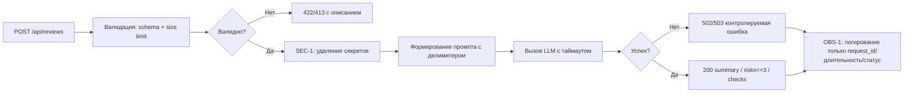

# Анализ процесса: AS IS и TO BE

## AS IS

Событие: клиент отправляет POST /api/reviews с JSON, содержащим поле "diff".

Участники: Клиент → FastAPI приложение → ReviewService → провайдер LLM.

Ход процесса:
- FastAPI-эндпоинт `create_review(payload: dict)` принимает произвольный `dict` без валидации и извлекает `payload["diff"]` (app/api.py, добавлено в diff).
- `review_service.review(diff)` формирует строковый промпт: `"Review this pull request and find problems:\n{diff}"` и синхронно вызывает `llm.generate(prompt)` без обработки ошибок (app/review_service.py, добавлено в diff).
- Ответ LLM оборачивается в `{"comment": answer}` и возвращается клиенту.

Задержки и риски:
- Синхронный вызов LLM может быть долгим; нет таймаутов/ретраев.
- При отсутствии ключа `diff` в теле запроса произойдёт `KeyError` → 500 вместо 422.
- Нет ограничений размера `diff`, возможны высокие затраты/DoS.

Точки потери информации:
- Возвращается только поле `comment`; нет структурированных полей, статуса, метаданных запроса/ошибок.
- Сырой `diff` попадает в промпт без изоляции, возможна prompt-injection.

## TO BE

Небольшое изменение процесса: валидируем вход (обязательное строковое поле `diff` и лимит размера), формируем безопасный промпт с делимитером, обрабатываем ошибки LLM и возвращаем контролируемые статусы (422/413/502).

## Разница

| Что меняется | AS IS | TO BE | Как проверим изменение |
|---|---|---|---|
| Валидация тела запроса | `dict` без проверки, `payload["diff"]` → 500 при отсутствии | Явная схема, обязательное `diff: str` | POST /api/reviews с `{}` → 422 |
| Лимит размера входа | Нет ограничений | Ограничение размера `diff`, отклонение 413/422 | Отправить большой `diff` (~10MB) → 413/422 |
| Обработка ошибок LLM | Нет, исключения пробрасываются → 500 | Таймаут/исключения маппятся в 502/503 | Замокать `llm.generate` на исключение/задержку → 502/503 |
| Безопасность промпта | Сырой `diff` в инструкциях | Делимитеры и явное указание «текст как данные» | Вставить в diff инструкции («ignore…») → не влияет на поведение |
| Структура ответа | Только `{"comment": str}` | OUT-1: summary, risks<=3 с file/line/evidence/risk, checks | Проверить OpenAPI/Swagger: схема указывает поля и типы |

## Как использовали AI

- Для чего: выявить риски в изменениях по diff и сформулировать проверяемые шаги.
- Тип промпта: zero-shot анализ на тексте `TRAINING_PR.diff`.
- Строка в [`prompts.md`](prompts.md): будет добавлена как запись о baseline-ревью `TRAINING_PR.diff` (P1-05).
- Что проверили и исправили сами: сверили выводы с конкретными строками из diff; убрали предположения вне представленного diff.
