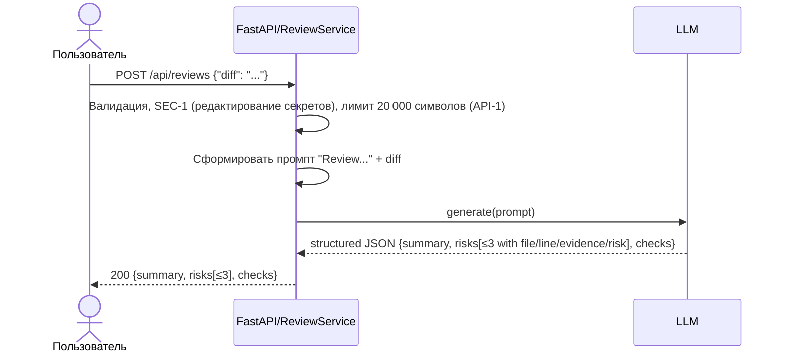

# Use cases и user stories

## Первый рабочий сценарий

**Когда** разработчик/интеграция отправляет POST `/api/reviews` с JSON, содержащим поле `diff`, **система** валидирует вход и применяет правила SEC-1 (редактирует секреты в `diff`), API-1 (отклоняет `diff` > 20 000 символов), REL-1 (таймаут 10 с и контролируемая ошибка внешнего LLM), OUT-1 (структура ответа), SCOPE-1 (только советует, без действий), QA-1 (включает только подтверждённые риски), OBS-1 (логирует только `request_id`, длительность и статус), **а пользователь получает** 200 OK с объектом, содержащим `summary`, массив `risks` (не более 3 элементов с полями `file`, `line`, `evidence`, `risk`) и массив `checks`.

Не входит в этот сценарий:

- Аутентификация и биллинг (управление доступом, тарификация, лимиты на пользователя/ключ).
- Пользовательский интерфейс (UI) и интеграции фронтенда.
- Выбор и сравнение провайдера LLM (поставщик, тариф, переключение провайдера).
- Изменение бизнес‑логики ревью (какие правила считать критичными, кто одобряет, процессы апрува/мерджа).

## Use case

| Поле | Значение |
|---|---|
| Актор | API‑клиент (разработчик/интеграция) |
| Триггер | POST `/api/reviews` с телом `{"diff": "..."}` |
| Предусловия | Приложение FastAPI запущено; `review_service` сконфигурирован с провайдером LLM |
| Основной результат | 200 OK, тело с `summary`, массивом `risks` (не более 3 элементов с полями `file`, `line`, `evidence`, `risk`) и массивом `checks` (OUT-1) |
| Ошибка или отказ | 422 при отсутствии `diff` (валидация), 413 при `diff` > 20 000 (API-1), 502/503 при ошибке внешнего LLM (REL-1); без approve/merge/edit (SCOPE-1) |



## User stories и acceptance criteria

```gherkin
Feature: Review pull request diff через API

  Scenario: Позитивный
    Given запущено приложение и доступен эндпоинт /api/reviews
    And валидный JSON-тело с полем diff: string
    When клиент отправляет POST /api/reviews с телом {"diff": "<diff>"}
    Then сервер возвращает 200 OK
    And ответ содержит summary: string
    And ответ содержит массив risks длиной не более 3
    And каждый элемент risks имеет поля file, line, evidence, risk
    And ответ содержит массив checks

  Scenario: Негативный
    Given запущено приложение
    And тело запроса пустое {}
    When клиент отправляет POST /api/reviews
    Then ожидается 422 Unprocessable Entity с описанием отсутствия поля diff (валидатор)

  Scenario: Граничный по API-1
    Given запущено приложение и включены правила API-1
    When клиент отправляет POST /api/reviews с телом размером ровно 20000 символов в поле diff
    Then сервер возвращает 200 OK
    And ответ соответствует OUT-1 (summary, risks≤3 с file/line/evidence/risk, checks)
    When клиент отправляет POST /api/reviews с телом размером 20001 символ в поле diff
    Then сервер возвращает 413 Payload Too Large
```

## Как использовали AI

- Для чего: сформировать use case, сценарии и зафиксировать проблемы (валидация, безопасность, устойчивость) по предоставленному diff.
- Тип промпта: zero-shot, анализ только `TRAINING_PR.diff`.
- Строка в [`prompts.md`](prompts.md): P1-03 — продуктовый анализ и проверяемые сценарии для `/api/reviews`.
- Что проверили и исправили сами: соотнесли выводы с конкретными строками diff (file:line), исключили допущения вне diff.
