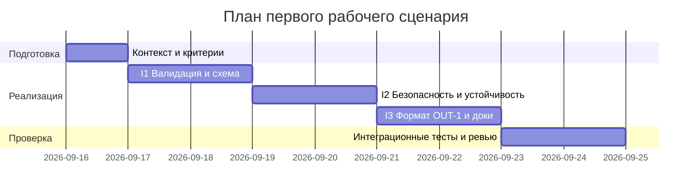

# План поставки

## Инкременты и ответственность

| Инкремент | Наблюдаемый результат | Что делает человек | Что делает AI или субагент | Проверка | Зависимости |
|---|---|---|---|---|---|
| I1: Валидация и схема API | POST `/api/reviews` с пустым телом возвращает 422; с валидным `{"diff": "..."}` — 200 и тело с `summary`, `risks` (не более 3 с полями `file`, `line`, `evidence`, `risk`), `checks` (OUT-1) | Отправляет запросы: пустое тело `{}` и валидное тело с `diff` | Обрабатывает валидный `diff`, вызывает LLM и возвращает ответ по OUT-1 | 1) POST `{}` → 422 (сейчас из-за `payload["diff"]` будет 500; app/api.py L35-38). 2) POST с `{"diff":"x"}` → 200 c OUT-1 | TRAINING_PR.diff; FastAPI; Pydantic‑схемы запроса/ответа |
| I2: Безопасность и устойчивость LLM | Ограничение `diff` по длине → 413 (API-1); ошибки/таймаут LLM маппятся в 502/503 (REL-1); в промпте `diff` обрамлён делимитером и секреты редактируются (SEC-1); логи без содержимого diff/ответа (OBS-1) | Пытается отправить слишком большой `diff`; провоцирует таймаут; шлёт тестовый `diff` с псевдо‑секретом | Санитизирует `diff`, добавляет делимитер, вызывает LLM с timeout=10s, ошибки переводит в контролируемый ответ; пишет только `request_id`, длительность, статус | 1) POST с `diff` >20000 символов → 413 (API-1). 2) Юнит: `llm.generate` бросает/висит → 502/503, не 500 (REL-1). 3) Юнит: вход с `token=...` → в сформированном промпте `[REDACTED]` (SEC-1). 4) Логи без содержимого diff/ответа (OBS-1) | I1; CASE.md правила SEC-1, API-1, REL-1, OBS-1; LLM‑клиент с таймаутом |
| I3: Формат результата по OUT-1 и документация | Ответ строго по OUT-1: `summary`, `risks[≤3]`, `checks`; Swagger отражает модели; правила QA-1 соблюдены | Отправляет валидный `diff` и просматривает `/docs` | Настраивает промпт на структурированный JSON, валидирует и возвращает OUT-1; ограничивает `risks` ≤3 и проверяет наличие полей | 1) POST валидного `diff` → 200 JSON со схемой OUT-1. 2) Swagger `/docs` показывает модели запроса/ответа. 3) Юнит: `risks` не более 3, поля есть (OUT-1, QA-1) | I1, I2; CASE.md правила OUT-1, QA-1, SCOPE-1 |

## Диаграмма Ганта

Даты указаны относительно текущей: старт 2026-09-16; длительности ориентировочные и могут корректироваться по результатам ревью.

## Как использовали AI

- Для чего: структурировать план поставки по `TRAINING_PR.diff` и правилам из CASE/Context Pack (SEC-1, API-1, REL-1, OUT-1, SCOPE-1, QA-1, OBS-1).
- Тип промпта: structured planning (входы ограничены `TRAINING_PR.diff`, `problem.md`, `context.md`, `CASE.md`).
- Строка в [`prompts.md`](prompts.md): P1-04.
- Что проверили и исправили сами: связали каждый инкремент с конкретными правилами CASE.md и текущими проблемами из diff (`app/api.py` L35-38; `app/review_service.py` L19-22, L20, L21); исключили предположения вне предоставленных артефактов; даты синхронизированы с текущим календарём.
